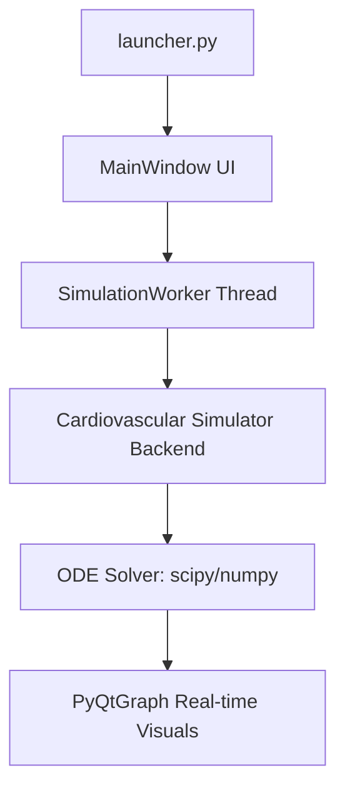

# GUI Development with Python (PySide6)

A curated collection of desktop applications and interactive widgets built with **Python**, **PySide6 (Qt for Python)**, and **PyQtGraph**. 

This repository starts with foundational Qt widgets, layouts, signals, and event propagation systems, and concludes with fully-fledged scientific simulation projects.

---

## Highlight Showcase: Cardiovascular Simulator (CV Sim v2)

The main feature of this repository is a multi-threaded **Cardiovascular & ECG Simulator** which replicates real-time blood flow, pressures, and chamber volumes based on physiological mathematical equations.

### Key Features
* **ODE Mathematical Solver**: Solves coupled Ordinary Differential Equations (ODEs) using NumPy/SciPy to simulate cardiac dynamics (with/without baroreflex loop).
* **Multi-threaded GUI**: Utilizes `QThread` and signal/slot communication to separate the numerical solving backend from the user interface, preventing GUI hangs.
* **Real-time Plotting**: High-performance visualizers rendering Aortic Pressure, Left Ventricular Pressure, Chamber Volumes, and Flow dynamics via `pyqtgraph`.
* **Sleek Dark UI**: Outfitted in a modern Dark Teal aesthetic using the `qt-material` theme.



---

## 📂 Repository Structure

* **`PySide6Basics/`**: 43 hands-on tutorial scripts covering QWidgets, Layout Nesting, Event Handlers, Signals & Slots, and custom widgets (like a Signal Annotator).
* **`QtDesignerBasics/`**: Visual layout design workflows utilizing `.ui` files and pre-compiling them to Python code (`pyside6-uic`).
* **`PyQtGraph/`**: High-performance static and real-time updating graphs.
* **`MiniProjects/`**: Complete desktop applications, featuring the Cardiovascular Simulator and ECG waveform generator.

---

## ⚡ Quick Start

### 1. Installation
Install the required dependencies:
```bash
pip install PySide6 numpy scipy pyqtgraph qt-material
```

### 2. Run the Cardiovascular Simulator
Navigate to the simulator folder and execute the launcher:
```bash
python MiniProjects/CV_Sim_Basic_v2/frontend/launcher.py
```

### 3. Run PyQtGraph Real-time Plotting
```bash
python PyQtGraph/02_Realtime_Updating_Graphs.py
```

*For in-depth analysis of the basic modules, custom widgets, and advanced topics, see the local `DOCUMENTATION.md` file.*
